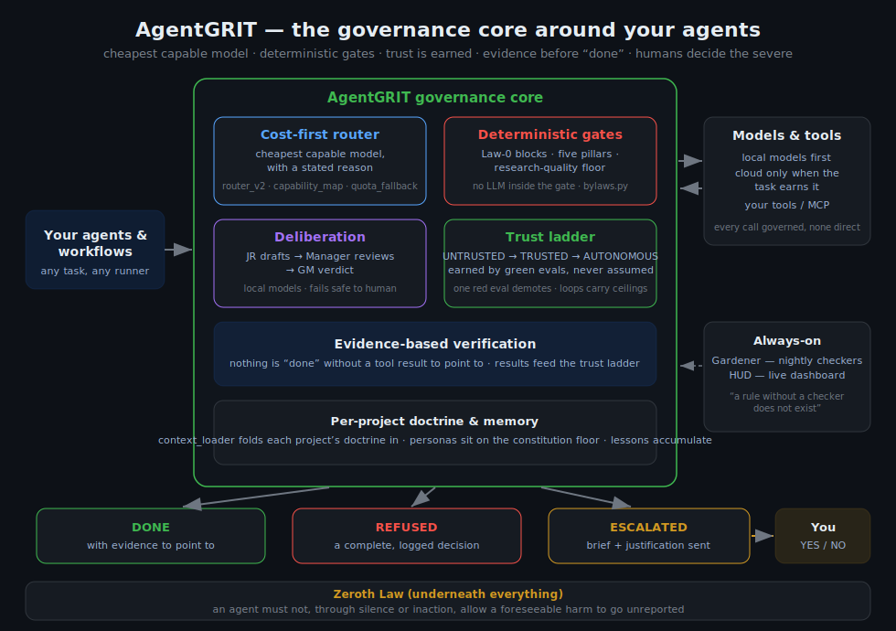

# AgentGRIT

> **Use AgentGRIT when mistakes are expensive, evidence is noisy, and you need a runtime that can justify a refusal, escalate to a human, and leave a reproducible trail.** It is a governance-first agent runtime -- not a general-purpose replacement for orchestration frameworks. See [docs/STATUS.md](docs/STATUS.md) for component maturity.

**Governed Recursive Intelligent Taskrunner**

> Cost-first LLM routing + self-governance + evidence-based verification, for people who want AI agents that don't quietly do the wrong thing.

AgentGRIT is a framework, not a product. It ships with governance, routing, and templates -- not a working agent for any specific business. You register your own agents on top of it.

---

## What This Is

AgentGRIT is a self-governing agent framework built around three ideas:

1. **Cost-first routing** -- classify each task and send it to the cheapest LLM capable of handling it (local Ollama first, cloud providers only when the task actually needs them), instead of defaulting everything to your most expensive model.
2. **Bylaws, not approval gates** -- agents enforce rules on themselves (block destructive commands, verify before committing, escalate genuine risk) rather than asking a human to approve every step.
3. **Escalation with teeth** -- when something needs a human, it is designed to go through an actual two-person-integrity flow (a deterministic, non-LLM approver plus your own sign-off over a notification channel such as Telegram -- a reference surface you wire to your orchestrator; see [docs/STATUS.md](docs/STATUS.md)), not a comment in a log file nobody reads.

A **Zeroth Law** runs underneath all of it: an agent must not, through silence or inaction, allow a foreseeable harm to go unreported. Finding a real risk and not mentioning it is its own failure mode. See `src/governance/bylaws.py` for the full doctrine.

---

## Architecture at a glance



A task is routed to the cheapest capable model, passed through deterministic bylaw and Pillar gates, deliberated by local models, then either handled by the GM (low/medium risk) or escalated to a human (high/critical) — and nothing is reported "done" without evidence to point to. A nightly gardener and a live HUD keep the system honest between runs.

Three more diagrams — the task lifecycle, the trust ladder, and per-project doctrine flow, each node mapped to the module that implements it: [docs/DIAGRAMS.md](docs/DIAGRAMS.md).

---

## Two Entry Points

AgentGRIT gives you two different tools depending on what you're doing:

| Entry point | What it's for |
|---|---|
| `python -m src.main` | Runs the agent orchestrator, API server, and (only if configured) the optional Telegram bot -- the place your own registered agents actually execute. |
| `python grit.py govern "<task>"` | A standalone cost-governance CLI: plans a task, decides which model tier it's worth, and verifies the outcome afterward -- independent of whatever coding agent actually runs it. |

They're complementary. `main.py` is where long-running or scheduled agents live; `grit.py` is a lightweight gate you can put in front of any one-off task, including tasks run through other tools entirely.

---

## Quick Start

```bash
# Clone and enter
git clone <your-fork-url> agentgrit
cd agentgrit

# Install
python3.11 -m venv venv
source venv/bin/activate
pip install -e .

# Configure
cp .env.example .env
nano .env   # add at least one LLM backend -- Ollama (free/local) or an API key

# Verify the core works (no external dependencies needed)
make agentgrit-smoketest

# Start the continuous observer loop
make run

# Or start everything (API + any agents you've registered; Telegram only if configured)
python -m src.main
```

Nothing runs unattended by default -- `python -m src.main` with no agents registered starts the API (plus the Telegram bot only if a token is configured -- Telegram is optional; any notification channel can be wired instead, see docs/NOTIFICATIONS.md) but does not invoke any agent logic. See `QUICKSTART-AGENTS.md` for registering your first one.

---

## Bylaw Governance

Agents don't get free rein and they don't need a human to approve every action either -- they operate inside rules they enforce on themselves.

**Absolute blocks** (never executed, no exceptions):

```python
BLOCKED = [
    "rm -rf /",              # Destructive delete
    "DROP TABLE",            # Database destruction
    "git push --force main", # Force push to main
    "curl | sh",             # Remote code execution
]
```

**Verify before commit** -- syntax valid, tests pass, lint clean, before any code change is considered done.

**Escalate real risk** -- credentials, permission changes, production deploys, and anything the bylaws flag as `ESCALATE` are designed to go through the two-person-integrity flow in `docs/ESCALATIONS.md`: a deterministic (non-LLM) Manager evaluates the request, and anything high/critical risk needs your explicit approval over a wired notification channel such as Telegram (a reference surface -- wire to your orchestrator; see `docs/STATUS.md`). A break-glass identity can view escalations but never approve them.

**Report transparently** -- you're informed, not asked, about task completions, scope changes, and blocked actions.

Roles determine what an agent can do at all: `OBSERVER` (read-only), `ANALYST` (analyze, no execution), `DEVELOPER` (writes code, PRs only), `EXECUTOR` (external actions gated, dry-run first), `ADMIN` (full capabilities). See `src/governance/bylaws.py`.

---

## Trust Is Earned

Agents don't start with full autonomy. Trust moves through a ladder based on track record, not on being asked nicely:

```
UNTRUSTED → (5 consecutive successes) → TRUSTED → (more successes) → AUTONOMOUS
     ↑                                                                    │
     └────────────────────────── any failure ───────────────────────────┘
```

See `src/governance/trust.py` and `src/governance/model_provenance.py` (the lineage gate that decides whether a given model is even allowed onto the ladder in the first place).

---

## Registering Your Own Agent

AgentGRIT ships a template, not an example business. Copy `src/agents/example_agent.py`, fill in the logic, and register it:

```python
# src/main.py
AVAILABLE_AGENTS = {
    "example": "Template agent -- copy src/agents/example_agent.py to build your own",
    "your_agent": "One-line description",
}
```

The template already wires up bylaws evaluation and persona rendering, so `run_once()` is the only part you have to write. Full walkthrough in `QUICKSTART-AGENTS.md`.

---

## Project Templates, Not Project Examples

`src/governance/persona.py` and `src/governance/context_loader.py` are empty by design: a `ProjectSoul` template and a `PROJECT_PATHS` registry you fill in with your own real projects. An unregistered or unconfigured project returns `NO_PROJECT_CONTEXT_FOUND` rather than silently proceeding with no context -- callers are expected to escalate on that, per the Zeroth Law.

Separately, `src/governance/personas.py` (plural) is a different thing: a small library of *expert-framing* personas (backend architect, DevOps engineer, code reviewer, technical writer) that the router auto-selects to improve prompt quality for complex tasks. That's about how a prompt is framed, not which client project you're working on -- the two systems solve different problems and are both intentional.

---

## Project Structure

```
AgentGRIT/
├── src/
│   ├── main.py                    # CLI entry point: API + Telegram + agent orchestrator
│   ├── config.py                  # Pydantic settings (.env-driven)
│   ├── agents/
│   │   ├── example_agent.py       # Template agent -- copy this to build your own
│   │   └── grit_agent.py          # Core agent loop (router + bylaws + memory)
│   ├── execution/
│   │   ├── router.py              # Cost-first multi-LLM routing
│   │   ├── router_v2.py           # Router used by the workflow/cost-governance layer
│   │   ├── capability_map.py      # Per-model capability + cost-tier data
│   │   └── verification.py        # Evidence-bundle / proof-of-work checks
│   ├── governance/
│   │   ├── bylaws.py              # Bylaw engine, roles, escalation triggers, Zeroth Law
│   │   ├── escalations.py         # Two-person-integrity escalation flow
│   │   ├── trust.py               # Trust-ladder state machine
│   │   ├── model_provenance.py    # Lineage gate for which models may run agentically
│   │   ├── persona.py             # Empty ProjectSoul template (fill in your projects)
│   │   ├── personas.py            # Generic expert-persona library (prompt framing)
│   │   ├── context_loader.py      # Per-project context loading (escalates if missing)
│   │   ├── identity.py            # Live identity block injected into local-model prompts
│   │   └── memory.py              # Bylaws-gated persistent agent memory
│   ├── workflow/                  # Cost-governance layer for Dynamic-Workflow-style runs
│   │   ├── planner.py
│   │   └── cost_governor.py
│   ├── evals/                     # Trust-ladder eval harness (transcript-vs-outcome grading)
│   ├── bot/
│   │   ├── telegram.py            # Telegram control surface (/status, /spawn, /digest, ...)
│   │   └── telegram_hardened.py   # Rate limiting, command whitelisting, approval nonces
│   ├── api/
│   │   └── server.py              # FastAPI server (health/status endpoints)
│   ├── database/
│   │   └── models.py              # SQLAlchemy models (tasks, memory, trust, usage)
│   └── security/
│       └── redact.py              # Secret redaction for logs
├── grit.py                        # Standalone cost-governance CLI (govern / eval / trust)
├── tests/                         # Pytest suite
├── docs/
│   ├── QUICKSTART.md
│   ├── ESCALATIONS.md             # Two-person-integrity escalation system
│   └── OLLAMA-SETUP.md
├── QUICKSTART-AGENTS.md           # Registering and running your own agents
├── GRIT-LEADER-PLAYBOOK.md        # Leader/builder/verifier workflow pattern
├── .env.example
├── Makefile
└── pyproject.toml
```

---

## Development

```bash
# Install dev dependencies
pip install -e ".[dev]"

# Run tests
pytest

# Run linting
ruff check .
black --check .

# Type checking
mypy src/
```

---

## Notifications

AgentGRIT can notify a human on escalation via a pluggable, opt-in channel (Telegram, webhook, or your own command) — no platform is hardcoded. See [docs/NOTIFICATIONS.md](docs/NOTIFICATIONS.md).

## Governance & research (self-inspection + evidence quality)

Beyond the bylaw engine, AgentGRIT ships a deterministic self-inspection and a
governed research layer:

- **Pillar Inspector** (`src/governance/pillars.py`) scores every high-stakes
  action against five misalignment pillars (fabrication, manipulation,
  deception, unpredictability, opacity) BEFORE it runs, producing an A-F
  scorecard. Deterministic by design.
- **Research layer** (`src/execution/research.py`, `research_providers.py`) is
  provider-agnostic and free-first: local cache -> keyless web search -> optional
  paid providers, tier-gated, budget-capped, with full provenance.
- **Research quality** (`src/governance/research_quality.py`) grades evidence by
  source tier + domain reputation + corroboration, and BLOCKS irreversible
  actions that rest on weak, uncorroborated research (escalate instead).
- **Deliberation** (`src/governance/deliberation.py`) runs a junior->manager
  local-model review before escalation. All thresholds are env/bylaw configurable.

## Security

Running AgentGRIT exposes agent-spawning and command-execution capabilities. Before exposing the API to any network, read [SECURITY.md](SECURITY.md) — it lists the hardening steps and documents the pre-publication security sweep.

## License

[FSL-1.1-MIT](LICENSE) (Functional Source License). Plainly: read it, audit it,
use it internally, self-host it, modify it, build on it — freely. The one thing
you may not do is sell a competing commercial product or hosted service built
from it. Each version automatically becomes plain MIT two years after its
release, so nothing stays locked forever.

---

## Acknowledgments

- Inspired by Asimov's Laws of Robotics.
- Runs on your models of choice — local Ollama first, with Claude, Grok,
  Perplexity, and others as governed cloud tiers.

*AgentGRIT: a governance layer for agents, not a business in a box. Bring your own projects.*

## Contributing

See [CONTRIBUTING.md](CONTRIBUTING.md). Governance changes must stay deterministic and tested.
