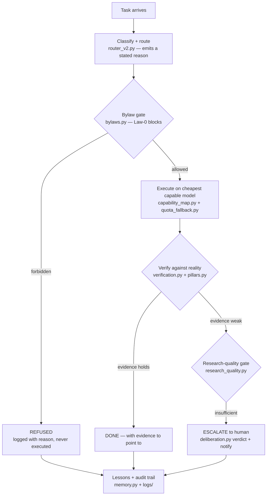
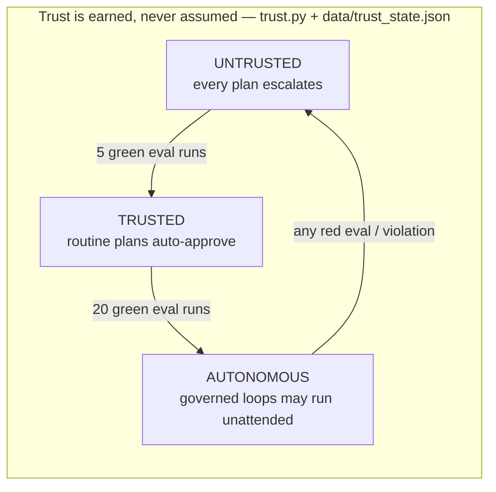
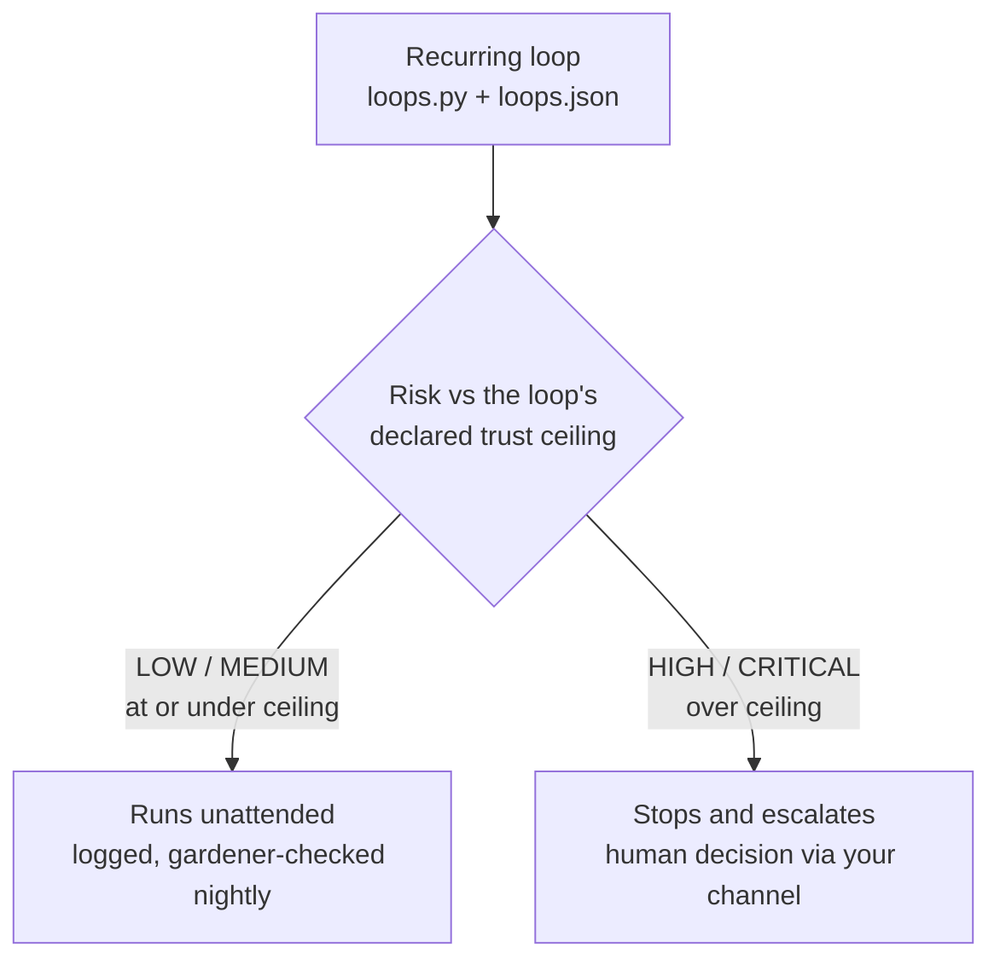
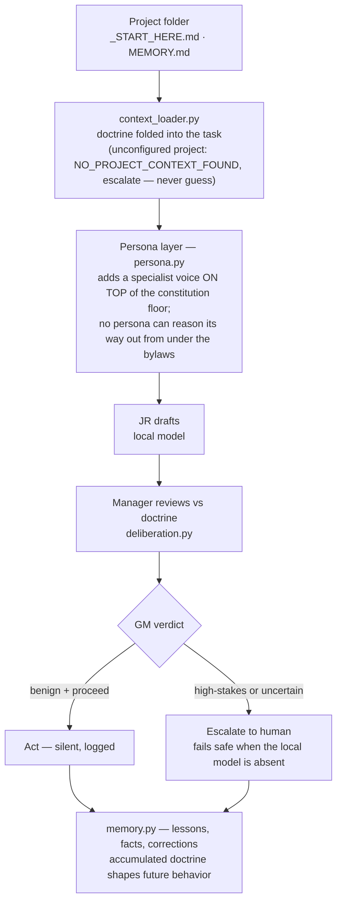
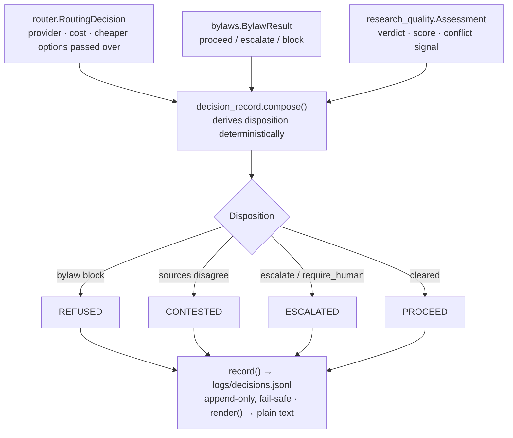

# AgentGRIT — How it moves

Four diagrams, four questions: how a task moves through governance, what may
run without a human, how per-project doctrine shapes the agents, and what the
audit trail captures. Every node names the module that implements it — the
diagrams are checkable against the code, not marketing shapes. (System overview:
[`architecture.svg`](architecture.svg) in the README.)

## 1. Task lifecycle — classify, route, verify, prove

Nothing reaches DONE without evidence; a refusal or escalation is a *complete,
logged outcome*, not a failure state.

## 2. Trust ladder — what runs without you

Demotion is one bad eval; promotion is many good ones. Loops carry their own
ceilings — a loop can never quietly exceed the autonomy it declared.

## 3. Per-project doctrine — specialists under one constitution

Personas and project configs ship empty by design — GRIT supplies the machinery
and the constitution; you supply the specialists and the projects.

## 4. Decision record — the auditable "why"

Every field traces to a real upstream result — nothing is invented or
estimated-as-fact. This is the artifact a compliance reviewer reads: what was
decided, the cheaper options passed over and why, the evidence behind it, and who
or which threshold authorized it. See `src/governance/decision_record.py`
(`python -m src.governance.decision_record` prints a sample of each disposition).
